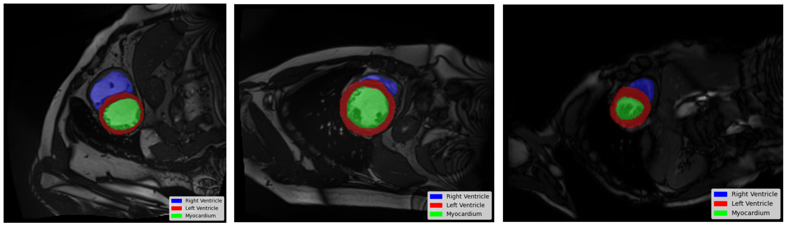
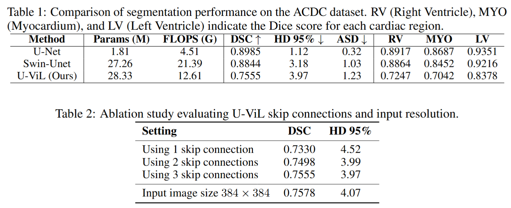
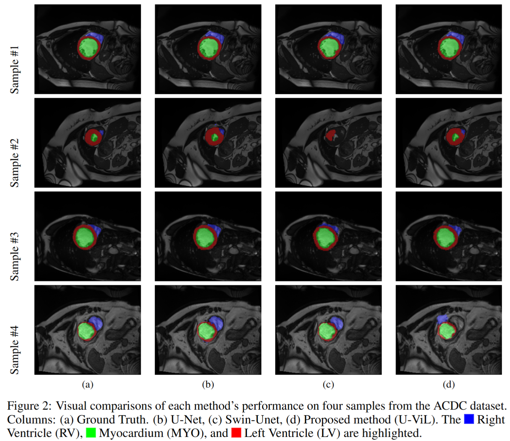

# U-ViL: A U-shaped Vision-LSTM Framework for Cardiac Image Segmentation

```
This is a repository for the final project of CS6363 course at Vanderbilt University.
```


Deep learning techniques have demonstrated remarkable success in medical image segmentation, but challenges remain in simultaneously capturing both global contextual dependencies and local structural details in the presence of structural variability. To address these challenges, we propose U-ViL (U-Net-like Vision-LSTM), a novel U-shaped architecture fused with extended Long Short-Term Memory units. U-ViL incorporates Vision-LSTM blocks as the backbone of an encoder-decoder framework, aiming to model both low-level features and long-range dependencies. We evaluate the proposed model on the Automated Cardiac Diagnosis Challenge dataset and benchmark it against widely used segmentation architectures, including the conventional U-Net and the transformer-based Swin-Unet. Although the current implementation of U-ViL does not yield overall superior segmentation accuracy, it reveals distinct qualitative feature representations and segmentation patterns compared to prevailing architectures, and may benefit from further enhancements through hierarchical integration. These findings highlight the potential for implementing a unified framework that combines recurrent modeling and spatial localization mechanisms for medical image analysis.

Download the ACDC dataset from this [Google Drive link](https://drive.google.com/file/d/1F3JzBSIURtFJkfcExBcT6Hu7Ar5_f8uv/view).



- Training:
```python
cd code

python train_fully_supervised_2D.py --model uvil --max_iterations 10000 --batch_size 4 --num_classes 4 --exp ACDC/Fully_Supervised
```

- Testing
```python
cd code

python test_2D_fully.py --model uvil --exp ACDC/Fully_Supervised
```
# Results

The quantitative and qualitative results is as follow:





# Contact
ehsan.khodapanah.aghdam[at]vanderbilt.edu

nicolas.c.disanto[at]vanderbilt.edu

# Acknowledgements
We gratefully acknowledge the authors of the following repositories, from which we utilized code in our work:

[Vision-LSTM](https://github.com/NX-AI/vision-lstm)

[Swin-Unet](https://github.com/HuCaoFighting/Swin-Unet)

[Mamba-UNet](https://github.com/ziyangwang007/Mamba-UNet/tree/main)